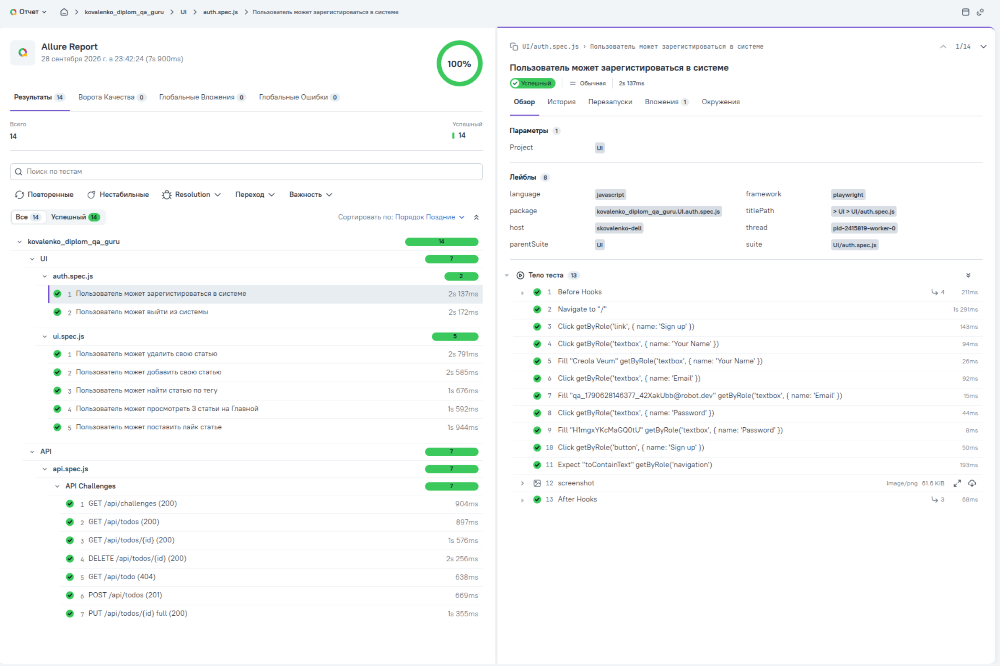
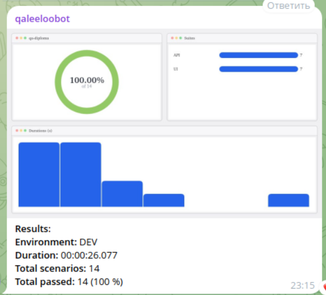
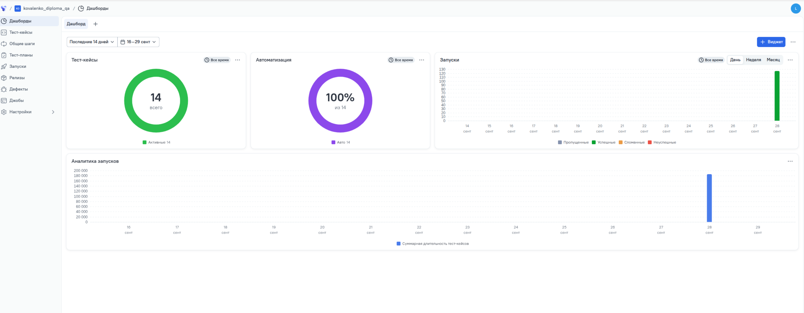

# Дипломная работа по автоматизации тестирования

Выпускная работа по курсам автоматизации тестирования. Проект представляет собой масштабируемый фреймворк для автоматизированного тестирования UI и API веб-приложений с использованием Playwright, паттернов Page Object и Builder, Allure TestOps, GitLab CI/CD и Telegram-уведомлений.

## Тестируемые приложения

- [RealWorld QA Guru](https://realworld.qa.guru/) — UI-тестирование веб-приложения.
- [API Challenges](https://apichallenges.eviltester.com/) — API-тестирование REST-сервиса.

## Что реализовано

В проекте реализовано 14 функциональных тестов:

- 7 UI-тестов: регистрация пользователя, выход из системы, просмотр статей, фильтрация по тегу, создание, удаление и лайк статьи.
- 7 API-тестов: получение списка challenges, создание и получение todo, проверка 404, получение todo по ID, полное обновление и удаление todo.

Архитектура проекта включает:

- Page Object Model для UI-страниц;
- фасады `AppPage` и `ApiService`, создаваемые через Playwright-фикстуры;
- Builder для генерации пользователей, статей и todo через Faker;
- API-сервисы для инкапсуляции HTTP-запросов;
- встроенные ожидания и ассерты Playwright в тестах;
- разделение UI- и API-тестов по отдельным директориям;
- Allure-отчётность и отправку результатов в Allure TestOps;
- Telegram-уведомления с текстовой сводкой и графиком результатов.

## Используемые инструменты

- JavaScript / Node.js / npm;
- [Playwright](https://playwright.dev/);
- [Faker](https://fakerjs.dev/) для тестовых данных;
- `allure-playwright` для сбора результатов тестов;
- [Allure TestOps](https://allure.qa.guru/project/5383/launches) для хранения и анализа запусков;
- `allurectl` для загрузки результатов в Allure TestOps;
- [Allure Notifications](https://github.com/qa-guru/allure-notifications) для Telegram-уведомлений;
- [GitLab CI/CD](https://gitlab.com/leeloo-group2/qa-diploma/-/jobs) для автоматического запуска тестов;
- Telegram Bot API для уведомлений о результатах.

## Структура проекта

```text
.
├── builders/              # Builder для тестовых данных
├── fixtures/              # UI- и API-фикстуры Playwright
├── pages/                 # Page Objects и UI-фасад
├── services/              # API-сервисы и API-фасад
├── tests/
│   ├── API/               # API-тесты
│   └── UI/                # UI-тесты
├── notifications/         # Конфигурация Telegram-уведомлений
├── media/screenshots/     # Скриншоты отчётов и TestOps
├── playwright.config.js   # Конфигурация Playwright
├── .gitlab-ci.yml         # GitLab CI/CD pipeline
└── package.json           # Зависимости и npm-скрипты
```

## Локальная установка

Требования:

- Node.js 20 или выше для запуска тестов;
- Node.js 26 или выше для полного запуска Allure Notifications 6.2.2;
- npm;
- Java 17 или выше — для генерации локального Allure Report.

Клонирование и установка зависимостей:

```bash
git clone https://gitlab.com/leeloo-group2/qa-diploma.git
cd qa-diploma
npm install
npx playwright install --with-deps
```

Для локальных Allure TestOps и Telegram-уведомлений задайте переменные окружения:

```bash
export ALLURE_TOKEN="<allure-token>"
export TELEGRAM_BOT_TOKEN="<telegram-bot-token>"
export TELEGRAM_CHAT_ID="<telegram-chat-id>"
```

Секреты не должны добавляться в репозиторий или файл `notifications/telegram.json`.

## Запуск тестов

Запустить все тесты:

```bash
npm test
```

Запустить тесты отдельно по проектам:

```bash
npx playwright test --project=UI
npx playwright test --project=API
```

Запустить тесты в UI-режиме Playwright:

```bash
npm run ui
```

Запустить генератор кода Playwright:

```bash
npm run code
```

## Генерация отчётов

### Playwright HTML Report

После запуска тестов открыть HTML-отчёт можно командой:

```bash
npm run report
```

### Allure Report

Сгенерировать локальный Allure Report:

```bash
npx allure generate
```

После генерации отчёт будет находиться в директории `allure-report`.

Открыть локальный Allure Report:

```bash
npx allure open
```

Для отправки результата в Telegram вместе с графиком:

```bash
npx @qa-guru/allure-notifications@6.2.2 send \
  --config notifications/telegram.json \
  --live
```

Уведомление содержит количество сценариев, длительность, процент успешных тестов и изображение с результатами по UI/API.

## GitLab CI/CD

Pipeline запускает тесты в Docker-образе Playwright и выполняет следующие действия:

1. устанавливает Java, npm-зависимости и браузеры Playwright;
2. запускает тесты через `allurectl watch`;
3. отправляет результаты в Allure TestOps;
4. генерирует Allure Report;
5. отправляет сводку и график в Telegram;
6. сохраняет `allure-results` и `allure-report` как CI artifacts.

Для запуска pipeline в GitLab должны быть добавлены защищённые CI/CD Variables:

```text
ALLURE_TOKEN
TELEGRAM_BOT_TOKEN
TELEGRAM_CHAT_ID
```

Страница запусков GitLab CI/CD: [открыть jobs](https://gitlab.com/leeloo-group2/qa-diploma/-/jobs).

## Полезные ссылки

- [GitLab-репозиторий проекта](https://gitlab.com/leeloo-group2/qa-diploma)
- [GitLab CI/CD jobs](https://gitlab.com/leeloo-group2/qa-diploma/-/jobs)
- [Проект в Allure TestOps](https://allure.qa.guru/project/5383/dashboards/5687)
- [RealWorld QA Guru](https://realworld.qa.guru/)
- [API Challenges](https://apichallenges.eviltester.com/)

## Скриншоты

### Allure Report



### Telegram-уведомление



### Allure TestOps


